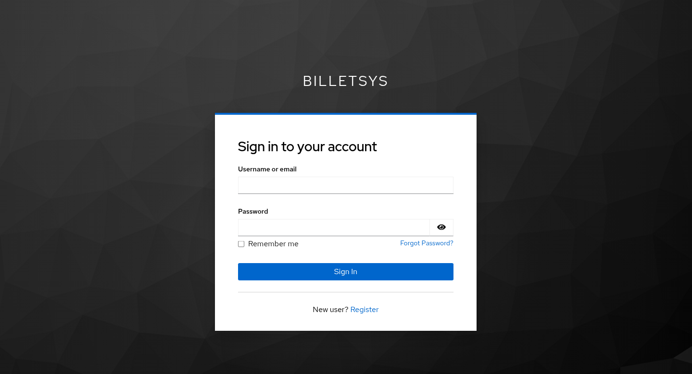
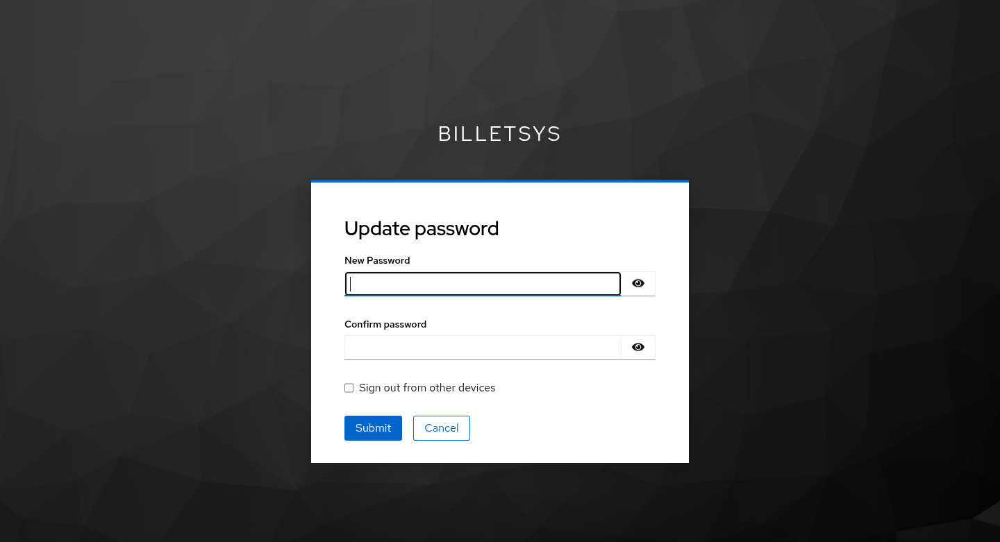

\newpage

# Security

The **Security** model in billetsys controls who can sign in, what they can access, and how role-based boundaries are enforced throughout the application.

{ width=100% }

## Purpose

Billetsys is built around differentiated roles and scoped access. Security is what makes that possible. It ensures that users reach the right parts of the system and that ticket, company, and administrative data are not treated as universally available.

## Keycloak

Billetsys uses **Keycloak** as its centralized identity provider.

### Key Benefits:
* **Centralized Credentials**: Manage your credentials securely through Keycloak.
* **Automatic Session Renewal**: Your session stays active while you work without interrupting your tasks.
* **Role-Based Access Control**: Capabilities and navigation are automatically tailored based on your assigned Keycloak realm roles.
* **Self-Service Security**: Update passwords securely using Keycloak's self-service workflows.

---

## How to Sign In

1. **Access Billetsys**: Open the application URL in your browser.
2. **Automatic SSO Redirection**: If you are not signed in, visiting protected areas will automatically redirect you to the official Keycloak SSO portal.
3. **Enter Credentials**: Enter your username and password on the Keycloak login screen and click **Sign In**.

{ width=100% }

4. **Role Dashboard Routing**: After successful authentication, Keycloak redirects you back to your role-specific home area (e.g., Support Workbench, Admin Dashboard, or Customer Ticket Portal).

---

## Account Provisioning & First-Time Sign-In

You do not need to manually pre-register inside Billetsys. On your first sign-in, Keycloak passes your authenticated profile (name, email, unique ID, and assigned roles) to Billetsys, which automatically provisions your account via **Just-In-Time (JIT) provisioning**.

Subsequent logins dynamically sync any updated profile details and role assignments from Keycloak.

---

## Active Sessions & Inactivity Timeout

* **Silent Token Renewal**: While actively working in Billetsys, background processes automatically renew your security tokens every 15 seconds.

---

## Self-Service Password Updates

To change your password:
1. Click your profile name/avatar in the top navigation bar.
2. Select **Change Password** (or navigate to `profile/password`).
3. You will be redirected to Keycloak's secure **Update Password** page.
4. Enter your new password, confirm it, and submit.

{ width=100% }

Upon completion, Keycloak safely redirects you back to Billetsys with a success confirmation toast.

---

## Signing Out (Logout)

To end your session securely:
1. Click your profile avatar in the top navigation bar.
2. Click **Sign out**.

Signing out invalidates your Keycloak session tokens across the application.
